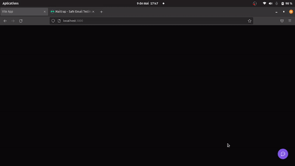

<h1 align="center">
    
</h1>

## 🏷️ Sobre 
**FeedbackWidget** é um pop-up para usuários enviarem seus feedbacks sobre alguma coisa relacionada a aplicação, seja ela um bug, ideia, ou qualquer outra coisa que faça sentido.

O projeto foi desenvolvido durante a NLW Return, evento produzido pela escola de tecnologia Rocketseat.

---

## 🛠️ Tecnologias e serviços utilizados
Foram utilizadas as seguintes tecnologias para desenvolver a aplicação **FeedbackWidget** :

- [React](https://pt-br.reactjs.org/)
- [Typescript](https://www.typescriptlang.org/)
- [TailwindCSS](https://tailwindcss.com/)
- [Prisma.io](https://www.prisma.io/)
- [Nodemailer](https://nodemailer.com/about/)
- [PostgreSQL](https://www.postgresql.org/)

---

## 🗂️ Como baixar e iniciar o projeto 

```bash

    #clonar o projeto
    $ git clone https://github.com/ElisioWander/feedback-wedget.git

    #entrar no diretório
    $ cd feedback-widget

    #instalar as dependências
    $ npm install

    #iniciar a aplicação
    $ npm run dev
```
### Servidor local
localhost:3000

---

## ⚠️ ALERT ⚠️
Para a aplicação funcionar por inteiro, é necessário que se baixe o back-end do repositório [back-end-feedback-widget](https://github.com/ElisioWander/back-end-feedback-wedget)

### obs: não precisa ter o postgreSQL instalado na máquina

--- 

Lembrando que para verificar o feedback no email, é necessário configurar no back-end o email que você deseja receber os feedbacks. Para testar se o email está chegando você pode utilizar o [Mailtrap.io](https://mailtrap.io/)

---

## Autor
### 👤 Elisio Wander

- Linkedin: [@elisioWander](https://www.linkedin.com/in/elisio-wander-b88b69136/)
- github: [@elisioWander](https://github.com/ElisioWander)

---
## 📝 Licença
Copyright © 2020 [@ElisioWander](https://github.com/ElisioWander/ignews-to-deploy/blob/main/LICENSE)

Este projeto está sobe a [LICENÇA MIT](https://opensource.org/licenses/MIT)

---

### Desenvolvido 💜 by Elisio Wander
